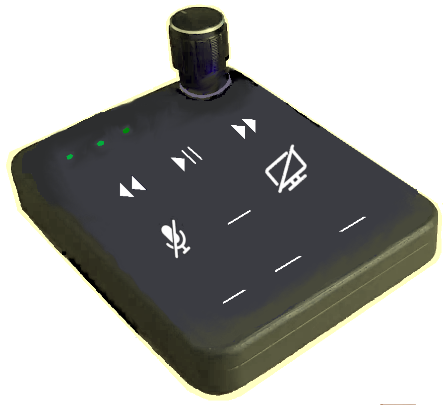
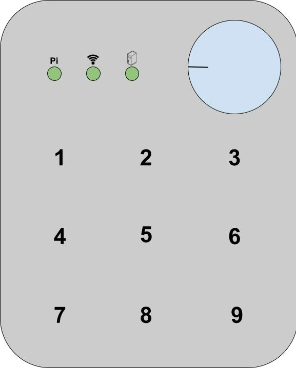

# Wi-Fi Macro Board / Macro Pad / Macro Keyboard

This project constructs a DIY macro board which has a clickable knob and 9 keys. The wireless device executes macros on a computer over Wi-Fi.

> Note: This is a proof of concept project. The response time over Wi-Fi is not as good as [Bluetooth](https://github.com/OnkarRuikar/bt-macro-remote) or [ESP-NOW](https://github.com/OnkarRuikar/esp-now-macropad) based macropads. I recommend you to implement ESP-NOW based [OnkarRuikar/esp-now-macropad](https://github.com/OnkarRuikar/esp-now-macropad) instead.

## Features

Following features are implemented out of the box:

- a clickable knob to control system's master volume. Knob click handles audio mute and un-mute.
- 9 touch keys
  - 4 keys to control media
    - play / pause
    - previous media
    - next media
    - mic mute
  - turn off monitor
  - 4 remaining keys could be configured to add more macros

Existing macro boards available in market are either wired (USB) or wireless (Bluetooth) HID devices. This wireless macro board uses Wi-Fi to communicate with PC.

### Implementation

Follow instructions in these documents:

1. [Required components](./docs/1_components.md)
2. [Host macro server on PC](./docs/2_macro_server.md)
2. [Programming Pi Pico W](./docs/3_program_pico_w.md)
3. [Assembling circuit](./docs/4_assembling.md)
4. Setting up macro server on Windows or Linux PCs
5. Troubleshooting
6. Improvements

## See also

Other similar projects:

- [ESP-NOW based macropad](https://github.com/OnkarRuikar/esp-now-macropad)
- [Bluetooth based macropad](https://github.com/OnkarRuikar/bt-macro-remote)
