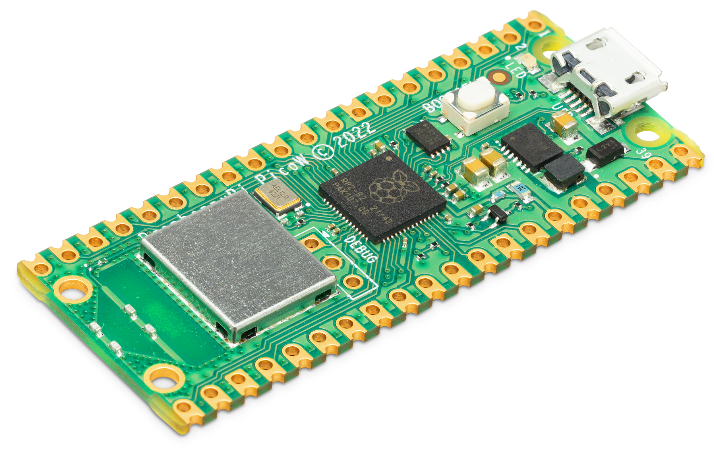
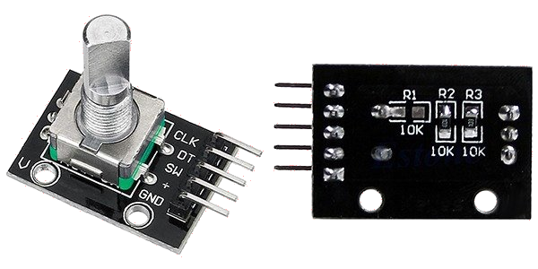
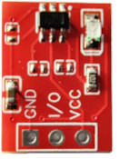
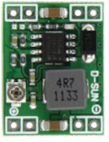
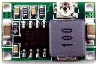

# Required components

Following components are required for the implementation:

1. [Raspberry Pi Pico W](https://mou.sr/3EpOvvz) - $6\

2. [Micro USB data cable](https://www.amazon.com/BRENDAZ-Micro-Cable-Charging-Transfer/dp/B09ZPZJWX6). Make sure the the cable supports data transfer and it is not a just charging cable.
3. [Rotary Encoder Module](https://www.amazon.com/Taiss-KY-040-Encoder-15%C3%9716-5-Arduino/dp/B07F26CT6B) or only the rotary encoder - $2\

Don't forget to buy a knob if not available with the rotary encoder. Note the encoder shaft shape and size (mostly 6mm and D-shaft).
4. Nine [TTP223 touch buttons](https://www.amazon.com/HiLetgo-TTP223-Capacitive-Switch-Self-Lock/dp/B01D1D0FLG) - $0.3\
\
5. [MP1584EN Buck converter](https://www.amazon.com/eBoot-MP1584EN-Converter-Adjustable-Module/dp/B07RVG34WR) or [Mini 360 buck converter](https://www.amazon.com/Teyleten-Robot-Converter-Airplane-Step-Down/dp/B0CPFDBJ6G) - $2\
\
or\

6. Double sided foam tape
7. Two [18650 batteries](https://www.amazon.com/AmazonBasics-High-Capacity-Rechargeable-Batteries-Pre-charged/dp/B00HZV9WTM) with [holder](https://www.amazon.com/SDTC-Tech-Parallel-Soldering-Electronic/dp/B08592R2CN). If you don't have a charger for the batteries then get a [charger](https://www.amazon.com/Battery-Charger-Single-Slot-Intelligent-Rechargeable/dp/B089SY8PBG/) as well.
8. Resistors\
  a. Three 500 ohm 1/4 watt resistors for LEDs.\
  b. (Optional) If you got rotary encoder and not the module then two 10k ohm resistors.
9. Three green LEDs.
10. Small [SPDT slide switch](https://www.amazon.com/uxcell-Position-Vertical-Switch-Solder/dp/B00DUYVXAE) or small [latching push buttons](https://www.amazon.com/mxuteuk-Self-Lock-Flashlight-Latching-BK-1208/dp/B086L2GPGX) to turn on and off the power.
11. [Label stickers](https://www.amazon.com/0-375-Coding-Circle-Sticker-Labels/dp/B081M6XPW4).
12. [Junction box](https://www.amazon.com/Otdorpatio-Junction-Waterproof-Electrical-3-94x2-68x1-97/dp/B0BGMX73TB/?th=1) to put circuit in. Or 4" x 3" x 1" transparent [storage box](https://www.amazon.com/Goodma-Rectangular-Organizer-Containers-Projects/dp/B08KSTZG92). You can 3D print a custom box as well.

## Tools

It is assumed that you already have following tools and know how to use them:

1. 25 watt [soldering iron](https://en.wikipedia.org/wiki/Soldering_iron) and solder wire
2. Any basic [multimeter](https://www.amazon.com/AstroAI-Digital-Multimeter-Voltage-Tester/dp/B01ISAMUA6/)
3. 26 to 30 AWG black and red cables for connecting components
4. Wire cutter/nipper

### Optional

1. [Tweezers](https://www.amazon.com/kaverme-Anti-Static-Electronics-Laboratory-Jewelry-Making/dp/B0BNNGC3Q2/) for holding tiny wires while soldering
2. [Breadboard](https://en.wikipedia.org/wiki/Breadboard) and [Breadboard jumper cables](https://www.amazon.com/EDGELEC-Breadboard-Optional-Assorted-Multicolored/dp/B07GD2BWPY/)

## Next

[Host macro server on PC](./docs/2_macro_server.md)
