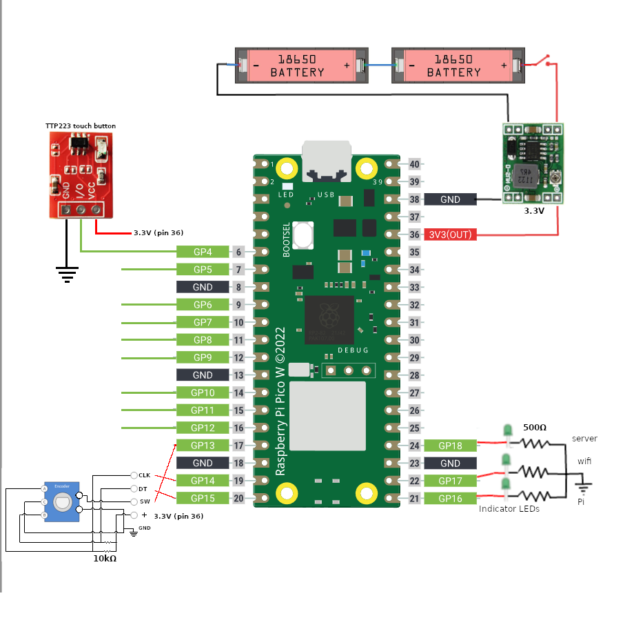

# Assembling components

Let's start putting the components together.

Till everything works perfectly for safety you can assemble the circuit on a breadboard. Or you can simply solder everything in open without putting it in a box. For testing runs connect only one touch button. We'll cover how to put final circuit in a box later.

Refer following diagram to solder the components together:

🤓 _All the rectangular golden colored holes on the Pico W board are ground pins. In the diagram they are labeled with black `GND` labels._

## Power supply

Let's assemble a power supply that provides 3.3V.

1. Recharge the batteries and put them in the holder. Make sure batteries are in series configuration as shown in the diagram above. Connect red and black wires to the holder.
2. Solder the switch. And switch it off.
3. Figure out input, output, +, and - positions on the buck converter module. Solder the buck converter module input to the battery pack.
4. Turn on the switch and measure output voltage of the buck converter using a multimeter.
5. Using a screwdriver gently rotate the potentiometer on the buck module so that the output voltage becomes 3.3V. Try to make voltage as close to 3.3V as possible.
6. Now turn off the switch and solder output wires of the buck converter to Pico W. The '-' wire is connected to pin 38 (GND) and the '+' wire is connected to pin 36 (3V3(OUT)).\
🤓 _Here we are bypassing the onboard power supply unit and directly powering the microcontroller. If the power source was 5V then we would've connected '+' wire to pin 39 (VSYS)._

## Status indicator LEDs

1. Note positive and negative legs on the three green LEDs. The longer leg is '+' and shorter leg is '-' side.
2. Connect '+' sides of LEDs to Pico W's pin 21, 22, and 24.
3. Connect negative sides of LEDs to 500 ohm resistors.
4. Connect other ends of the resistors together and solder them to Pico W's pin 23 (GND).

## Rotary encoder

If you have the rotary encoder module then simply connect the pins as follows:

- `CLK` to Pico pin 19 (GP14)
- `DT` to Pico pin 20 (GP15)
- `SW` to Pico pin 17 (GP13)
- `+` to Pico pin 36 (3V3(OUT))
- `GND` to Pico pin 18 (GND)

The connections are shown using red lines in the diagram.

If you have just the rotary encoder and not the module, then you need to connect 10k ohm resistors as shown in the diagram above (you'll have to zoom in on the lower left bottom part of the image). Mark the outputs as shown in the figure and connect the pins as mentioned in above list. It may look complex in the diagram but it is just addition of two resistors.

## Touch buttons

For now we connect only one button till we complete testing. Connect the button pins as follows:

- `VCC` to Pico pin 36 (3V3 (OUT))
- `I/O` to Pico pin 6 (GP4)
- `GND` to Pico pin 8 (GND)

## Testing the circuit

Now we test the circuit. Touching the the button should execute a macron on PC.

1. Make sure the battery power button is **switched off**.
2. Using micro USB cable connect the Pico W to PC.
3. Open Thonny IDE and connect to the Pico W in the IDE.
4. Open main.py file from Pico W in the IDE and make sure the tab is in front.
5. Uncomment the `#print(str)` line by removing the `#` character.
6. Run the file by pressing the green `Run current script (F5)` button in IDE.
7. Keep monitoring the logs.
8. First the power LED should light up.
9. Then after connection to Wi-Fi is made the Wi-Fi LED should light up.
10. Start the macro-server on your PC.
11. The third LED should light up.

